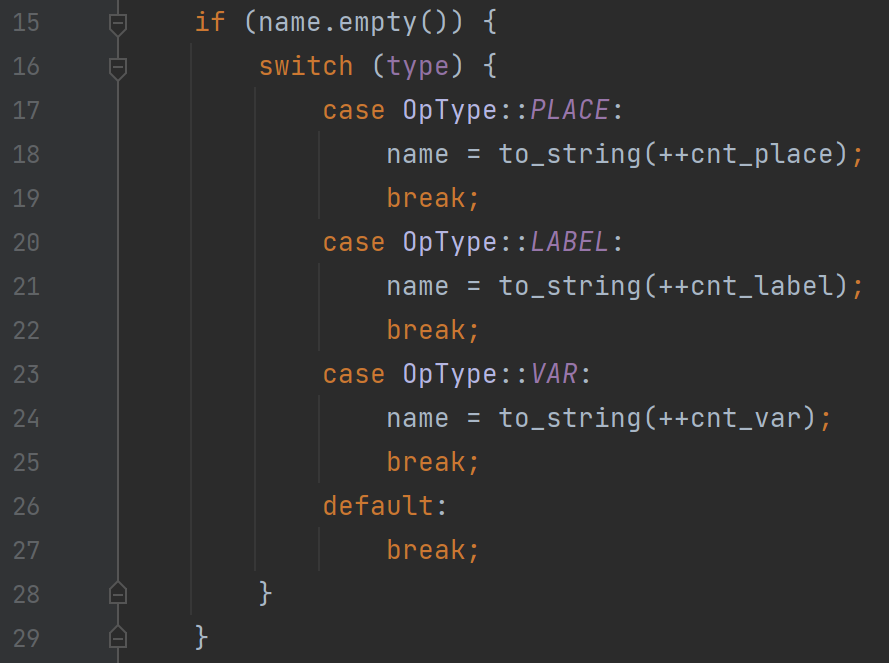
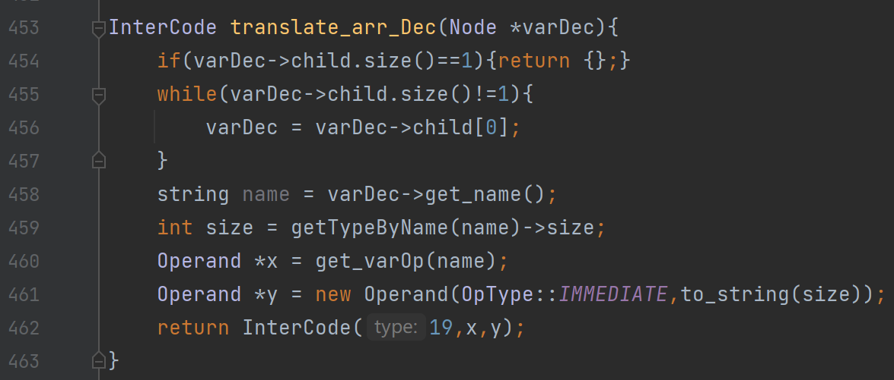
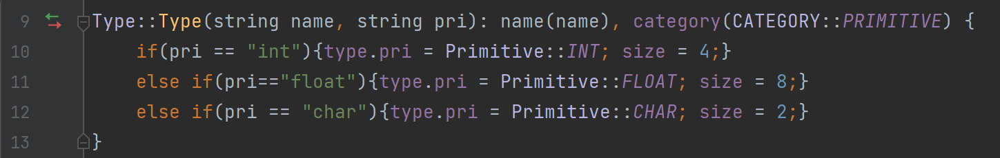
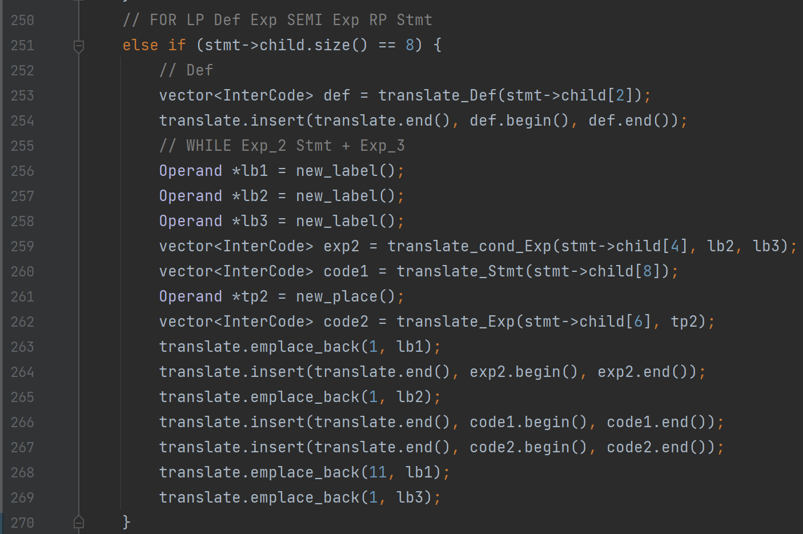
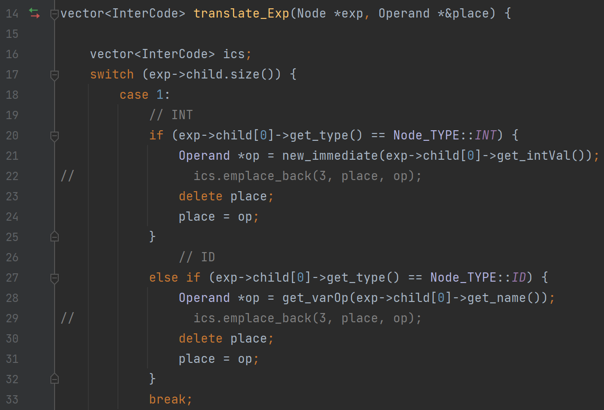

# CS323 Project3

###  Intermediate-Code Generation

##### **Team Members: Li Yuanzhao(11812420), Xu Xinyu(11811536), Jiang Yuchen(11812419)**

## I. Overview

​		In this project, we are required to implement the generation of intermediate code of given programs with SPL language. We suppose that there is no lexical or semantic error. **Three Address Codes(TAC)** are generated according to given rules. Our files can be run successfully with GCC version 7.4.0, GNU Flex version 2.6.4 and GNU Bison version 3.0.4 .


## II. Design and Implementation

### A. InterCode

​		We construct the class named `InterCode` to record 24 kinds of TAC information according to appendix. An InterCode object can have at most three Operand objects for storing information. The `NONE` type is defined for unnecessary instructions which can be reduced for less instructions.

```C++
#include <string>
using namespace std;
enum class OpType {
    PLACE,LABEL,VAR,IMMEDIATE,NAME,NONE
};
class Operand {
public:
    OpType type;
    string name;
    Operand(OpType type);
    Operand(OpType type, string name);
    string get_name();
};
enum class InterCodeType {
    NONE = 0,LABEL,FUNCTION,ASSIGN,ADD, SUB, MUL, DIV,ADDR,PTR,COPY,GOTO,IF_S,IF_SE,IF_B,IF_BE,IF_NE,IF_EQ,
    RETURN,DEC,PARAM,ARG,CALL,READ,WRITE
};
class InterCode {
public:
    InterCodeType interCodeType;
    Operand *x{};
    Operand *y{};
    Operand *z{};
    InterCode();
    InterCode(int type, Operand *x = nullptr, Operand *y = nullptr, Operand *z = nullptr);
    void print();
};
```

### B. Translate

​		After that, we continue to build up translate functions for expressions, statements, arguments and so on. According to the given schemes tables, we implement the translate action for each rule. The results are stored in `vector<InterCode>` since the result may contains more than one TAC instruction. We use merge method to construct TAC result for `ExtDef` , `CompSt`, `DefList` and `StmtList` since we can translate them using their children components.

​		When translating, we may need to new place, label, variable or immediate number. We set `new_place()` , `new_label()` , `get_varOp()`  and `new_immediate()` functions to generate them. Specially, we will not give exact id for new place, new label and new variable, which will be given when constructing result(Designed in `InterCode.cpp`).

​															 

​													Figure.1 Using global counters to give names

### C. Bonus

  1. What's more, we support translating array declaration which is provided in `translate_arr()` ,  and `translate_arr_Dec()` functions. Also, we modify the class `spl_type` and add an int member `size` for it to store the space cost for possible usages.   `translate_arr_addr()` are used for computing offset when fetching the address.

     ​										 

​													Figure.2 `translate_arr_Dec()` function

​			When translating array or structure, we can start from its primitive type which is set in type constructor. Using them and the array dimensions or struct contents to count for final space cost. It's useful for TAC-19 which is `DEC x [size]` .



​													Figure.3 Set size for primitive type

  2. We support `For` statements' translation which is implemented in `vector<InterCode> translate_Stmt(Node *stmt)` . Its actions are similar as `While` 's actions. 

     

     ​											Figure.4 Translation For Statements

  3. 


### D. Optimization

 1. When translating expressions, if the expression is a single INT or or ID, we don't need to store the operand in given place. Thus, we will not add the TAC instruction into translation result.

    

    ​											Figure.5 Delete unnecessary instructions

 2. 

## III. Test Cases

​			For extra test cases, we put them in `./test-ex/` folder which contains four test cases. They are used for array&structure translation, for-statements translation, .......

​			**- Test case with Array Translation**

```SPL
// TBD
-----------------------------------------------
// TBD
```


## IV. Instructions

​			Change directory to the root path and using `make splc` to create `splc` in `./bin` root for spl codes' parsing. Then using `bin/splc <test_root>/<test_file_name>` to create immediate code result. And you can use `make clean` to delete all created files.
